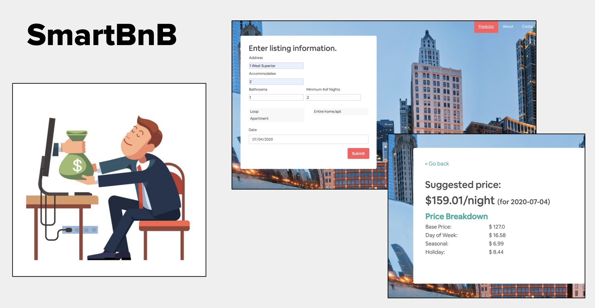
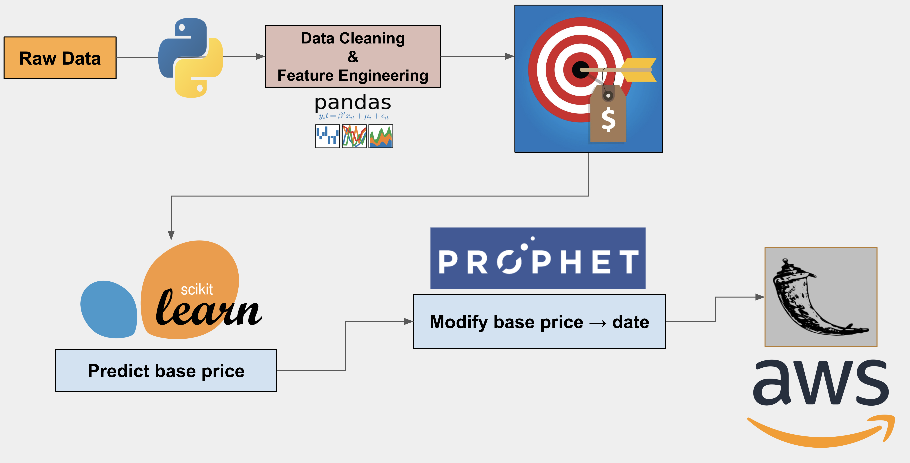

# SmartBnB
Inisght Data Science Project: http://smartbnb.live/

# Background
With the revenue generation opportunities airbnb offers, more and more people are interested in becoming hosts,
however, this potential for revenue generation is only realized with the right pricing strategies. Overpricing results in low booking rates and underpricing directly results in loss of revenue.

So pricing is very important but it can also be a very confusing process.
While Airbnb offers some general guidelines, there are currently no free, flexible, and reliable tools that provide pricing strategies to new hosts.

That’s exactly what SmartBnB provides!
Its user base will be new hosts in Chicago, and it’s goal is to help maximize their revenue by providing smart pricing based on data from their successful competitors.
In other words, I built my models based on listings with high occupancy rates and high review scores so that suggested listing price will yield high booking rates as well.

# Data
To build this app, I scraped Chicago airbnb data from a third-party database, called insideairbnb (http://insideairbnb.com/about.html). There were around 100 features available in the dataset, I removed uninformative features, engineered new ones such as distance to downtown from address, and different categories of amenities,..then I removed collinear features and what ended up going into my final model were 30 features related to property attributes.

# SmartBnB pipeline

Smartbnb’s pricing tool has two major components.
The first component is a machine learning model that calculates a base price according to property information, 
and the second one is a forecast model that modifies the base price as a function of date. 
The final results are then served to the user in a flask app hosted on an AWS.

Given my input feature space, to reduce the risk of overfitting, I chose the Elastic Net Regression model. Cross-validation of my results showed an average prediction error of $30.

Model results showed that three parameters had the most predictive power: Room type, # of people accommodated, and neighborhood, with neighborhood being the most important one.
This was rather expected, as you can see here, there is a substantial difference in listing prices among different neighborhoods in chicago.

For my time series analysis, I used facebook's prophet model. I cross-validated it using historical data which showed that predictions were on average within 5-7% of the original values.

# Validation

So,...How do smartbnb prices compare to actual airbnb listings? To answer this question, I looked at prices of similar properties on a specific date across several neighborhoods.

As you can see here, while predicted prices, shown by stars, are within airbnb ranges, often times than not, they are above median values,..So what does this mean for new hosts?
Well, Let’s say, a user has a 1-bedroom apartment in the avondale neighborhood, if they look at values around them on a specific date, they might set the price at $120, but Smartbnb shows that based on historical data they can actually get $140 for their property in this region at this time of year. This example demonstrates how hosts can increase their profits if they use this app as opposed to looking at the limited number of data points around them.

So, thanks to SmartBnb, New airbnb hosts in Chicago have access to a free pricing tool with reliable predictions that helps them increase their revenue.
